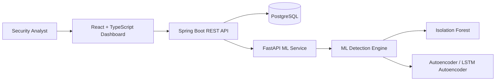
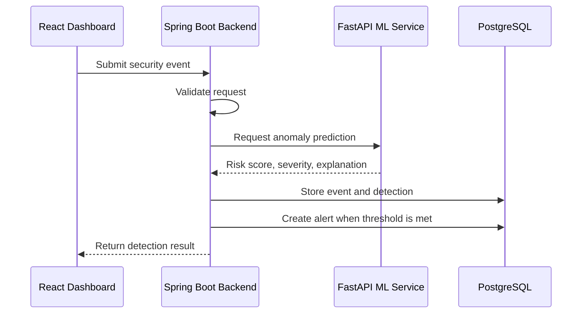
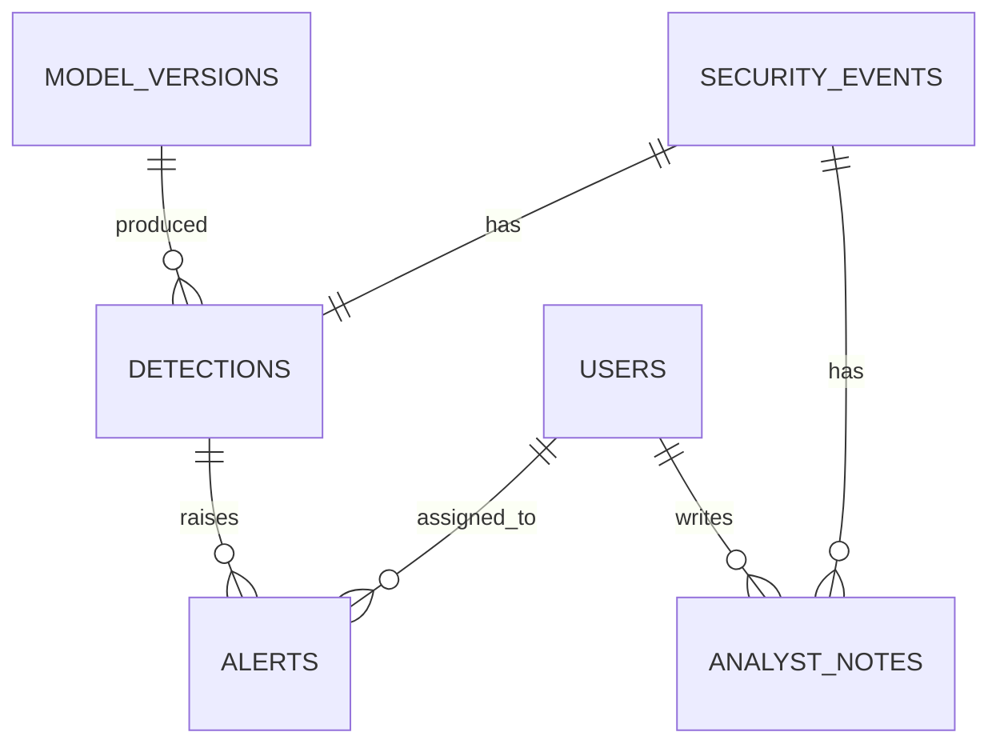
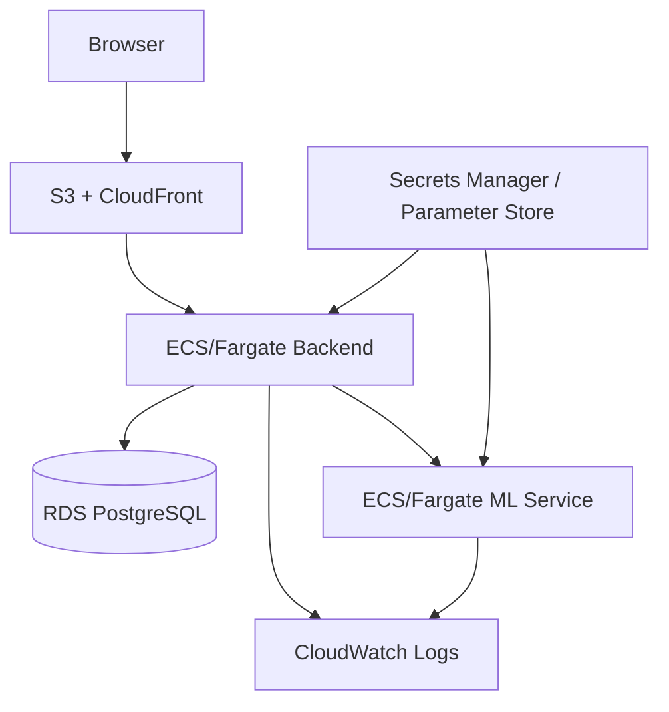

# ZeroGuard AI Architecture

This document will grow as each implementation phase is completed. Phase 1 defines the target architecture and boundaries.

## System Architecture

## Event Detection Flow

## Planned Database Relationships

## Deployment Direction

Local development will use Docker Compose. AWS deployment documentation will be prepared later, but the project will not be deployed to AWS in this academic build.

